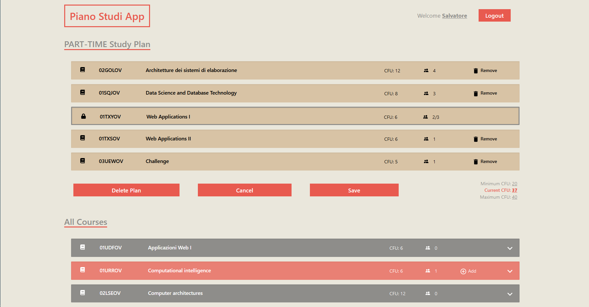

# Exam #1: "Piano degli studi"
## Student: s298877 CIRONE SALVATORE

## React Client Application Routes

- Route `/`: Home Page with all the courses and the study plan. When the user is not logged in, shows the courses only with their description. When a user logged enters the page they will see a richer interface with their study plan and the buttons to create / delete / update it
- Route `/login/`: Login Page with its form. Simply allows the user to login to unlock study plan functionalities..

## API Server

#### Overall Folder Structure.
The API has been structured differently, so it will be briefly described here.

`./src/routes`: Contains the routes of every different section of the api (i.e. course, session, study-plan)  
`./src/services`: Here will be found the services the operates with the Database and builds responses objects  
`./src/validations`: This folder holds the express-validator expressions for every section, to keep a clean interface in the routes file.  
`./src/middleware`: Groups all the CUSTOM middlewares to be used inside the API.  
`./src/libs`: Contains a thin wrapper to the database library.  

### Session
- POST `/api/session/`
  - Body:
      - user: Username and Password to login with
  - Responses:
    - 200: User informations (name + username)
    - 401: Wrong or missing credentials
    - 422: Invalid Username format

- GET `/api/session/current`
  - Responses:
    - 200: User informations (name + username)
    - 401: User not authenticated

- DELETE `/api/session/current`
  - Responses:
    - 200: OK (logout if any session was present)

### Courses
- GET `/api/courses/`
  - Responses:
    - 200: All Courses informations
    - 500: Internal Error

- GET `/api/courses/:code/`
  - Path Parameters
    - code: Course code
  - Responses:
    - 200: incompatible and preparatory courses relative to the course with :code
    - 422: Invalid code passed
    - 404: No course found with code :code
    - 500: Internal Error    
  
- GET `/api/courses/:code/details`
  - Path Parameters
    - code: Course code
  - Responses:
    - 200: incompatible and preparatory courses relative to the course with :code
    - 422: Invalid code passed
    - 404: No course found with code :code
    - 500: Internal Error

- POST `/api/courses/incompatibles`
  - Body:
      - courses: A list of courses to compute the incompatibilities with
  - Responses:
    - 200: List of incompatible courses
    - 500: Internal Error

### StudyPlan
- GET `/api/study-plan/`
  - Responses:
    - 200: The study plan associated with the authenticated user
    - 401: User not authenticated
    - 404: No study plan associated with authenticated user
    - 500: Internal Error

- POST `/api/study-plan/`
  - Body:
      - studentType: part-time or full-time specification for study plan to create.
      - courses: list of courses to save to the study plan
  - Responses:
    - 200: The newly created study plan
    - 422: Validation error on studentType
    - 401: User not authenticated
    - 500: Internal Error

- PUT `/api/study-plan/`
  - Body:
      - courses: the updated courses in the study plan
  - Responses:
    - 200: Ok, study plan saved.
    - 422: Missing courses object in body
    - 401: User not authenticated
    - 500: Internal Error

- DELETE `/api/study-plan/`
  - Responses:
    - 200: Study plan correctly destroyed if any.
    - 401: User not authenticated
    - 500: Internal Error

## Database Tables

- Table `user` - contains: username, password, salt, name, studentType
- Table `courses` - contains: code, name, credits, students, maxStudents, preparatoryCourseCode
- Table `incompatible` - contains: courseCode, courseCodeWith
- Table `studyPlan` - contains: courseCode, username

## Main React Components

- `Header`: The header of the whole app with the Login/Logout button
- `CourseList`: Represents the courses list
- `CourseEntry`: Represents a single entry inside the courses list. During edits it validates that the course may be added and, if negative, shows the reason why on mouse hovering. 
- `CourseEntryDescription`: Description panel paired with a CourseEntry. Shows the preparatory course and incompatibles, if any.
- `LoginForm`: Contains the form for logging in a registered user
- `ErrorBanner`: Manages errors that needs to be displayed to the user.

(only _main_ components, minor ones may be skipped)

## Screenshot

## Users Credentials

- testuser, password, Francesca, NULL (no study plan) 
- scirone , password, Salvatore, part-time
- mrossi, test, Mario, full-time
- jdoe, test, John, part-time
- abianchi, test, Alessia, part-time 
